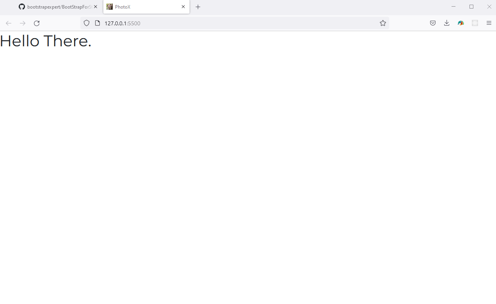

# Bootstrap4TemplateStarter

This is the bootstrap 4.X template using the latest version of Bootstrap 4.



# Font Awesome - Using it Locally

It is possible to serve fonts directly from the font awesome servers. That comes with limitations. Better to use it locally.

1. The /css/all.css file contains the core styling plus all of the icon styles that you’ll need when using Font Awesome. The /webfonts folder contains all of the typeface files that the above CSS references and depends on.

1. Copy the entire /webfonts folder and the /css/all.css into your project’s static assets directory (or where ever you prefer to keep front end assets or vendor stuff).

1. Add a reference to the copied /css/all.css file into the <head> of each template or page that you want to use Font Awesome on.

```
    <head>
    <link href="/your-path-to-fontawesome/css/all.css" rel="stylesheet"> <!--load all styles -->
    </head>
    <body>
    <i class="fas fa-user"></i> <!-- uses solid style -->
    <i class="far fa-user"></i> <!-- uses regular style -->
    <i class="fal fa-user"></i> <!-- uses light style -->
    <!--brand icon-->
    <i class="fab fa-github-square"></i> <!-- uses brands style -->
    </body>

```

# References

1. https://fontawesome.com/how-to-use/on-the-web/setup/hosting-font-awesome-yourself

# Hire Me

I work as a full time freelance software developer and coding tutor. Hire me at [UpWork](https://www.upwork.com/fl/vijayasimhabr) or [Fiverr](https://www.fiverr.com/jay_codeguy).

# Hobbies

I try to maintain a few hobbies.

1. Podcasting. You can listen to my [podcast here](https://stories.thechalakas.com/listen-to-podcast/).
1. Photography. You can see my photography on [Unsplash here](https://unsplash.com/@jay_neeruhaaku).
1. Digital Photorealism 3D Art and Arch Viz. You can see my work on this on [Adobe Behance](https://www.behance.net/vijayasimhabr).
1. Writing and Blogging. You can read my blogs. I have many medium Publications. [Read them here](https://medium.com/@vijayasimhabr).

# important note

This code is provided as is without any warranties. It's primarily meant for my own personal use, and to make it easy for me share code with my students. Feel free to use this code as it pleases you.

I can be reached through my website - [Jay's Developer Profile](https://jay-study-nildana.github.io/developerprofile)
