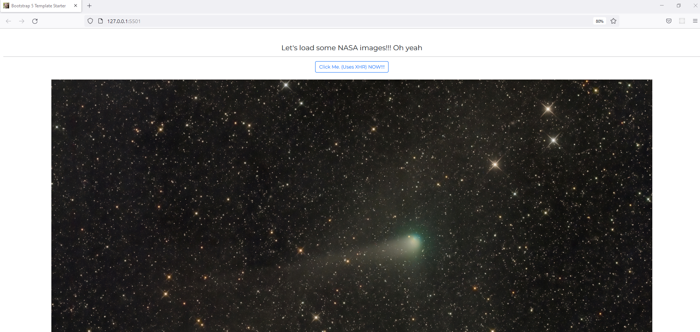

# NASA APOD XHR and Fetch Demo

Just using the quick and easy NASA APOD API to show how XHR and Fetch can be used.

Note : you can get the bootstrap starter template from here, https://github.com/Jay-study-nildana/FrontEndForStudents/tree/main/BootstrapForStudents/Bootstrap5

# References

1. https://stackoverflow.com/questions/38235715/fetch-reject-promise-and-catch-the-error-if-status-is-not-ok
1. https://developer.mozilla.org/en-US/docs/Web/API/Fetch_API/Using_Fetch
1. https://apod.nasa.gov/apod/lib/about_apod.html
1. https://github.com/nasa/api-docs
1. https://blogs.windows.com/msedgedev/2016/05/24/fetch-and-xhr-limitations/

# Hire Me

I work as a full time freelance coding tutor. Hire me at [UpWork](https://www.upwork.com/fl/vijayasimhabr) or [Fiverr](https://www.fiverr.com/jay_codeguy). 

# Hobbies

I try to maintain a few hobbies.

1. Podcasting. You can listen to my [podcast here](https://stories.thechalakas.com/listen-to-podcast/).
1. Photography. You can see my photography on [Unsplash here](https://unsplash.com/@jay_neeruhaaku).
1. Digital Photorealism 3D Art and Arch Viz. You can see my work on this on [Adobe Behance](https://www.behance.net/vijayasimhabr).
1. Writing and Blogging. You can read my blogs. I have many medium Publications. [Read them here](https://medium.com/@vijayasimhabr).

# important note 

This code is provided as is without any warranties. It's primarily meant for my own personal use, and to make it easy for me share code with my students. Feel free to use this code as it pleases you.

I can be reached through my website - [Jay's Developer Profile](https://jay-study-nildana.github.io/developerprofile)
