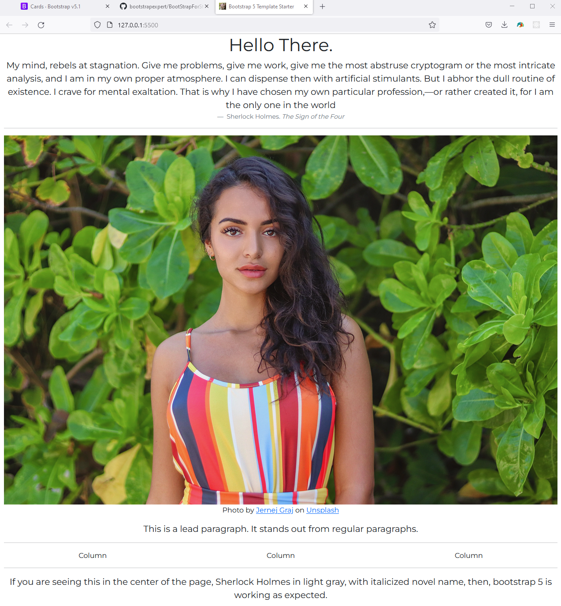

# Bootstrap 5 Demo Projects

These are the projects that I have modified as part of my own practice, and have made available for my students.

Please note that, my changes are cosmetic at best. A image change, some text change there. The purpose to show that, my students, after the basic training of bootstrap can remix them at a surface level. As always, I am only interested in teaching the basics.

Note : This page is long has too much. Sorry about that. Scroll down until you get something specific you are looking for.

# StartBootstrap Projects Remixed

1. [startbootstrap-sb-admin](startbootstrap-sb-admin) - This is a simple admin dashboard. As usual, I have remixed with my own changes.
1. [startbootstrap-freelancer](startbootstrap-freelancer) - A simple freelancer theme. remixed as usual.

# George Lomidze Projects Remixed

This is essentially the 4.X projects that were updated to work with the new Boostrap 5.0 by me.

1. [PhotoX](PhotoX) - This was the very first project I remixed. So, this contains the maximum amount of detail in terms of comments and explanations. If you are learning CSS, start with this project. It has the maximum number of comments.
1. [Admin Dashboard](AdminDashboard) - This was the second project I remixed. It contains less comments than PhotoX. Better to go through this after PhotoX.

My belief is, if you can understand the code inside the project [PhotoX](PhotoX), interpret each line, and make meaningful remixes of the code and give it your own, customized look, you are good to go.

# Starter Projects

1. [Bootstrap5TemplateStarter](Bootstrap5TemplateStarter) - starter project.
1. [Bootstrap5TemplateStarterMaleModel](Bootstrap5TemplateStarterMaleModel) - starter project. with a male model photo.
1. [Bootstrap5TemplateStarterCutePanda](Bootstrap5TemplateStarterCutePanda) - starter project. with a panda photo.
1. [Bootstrap5TemplateStarterAmeeshaPatel](Bootstrap5TemplateStarterAmeeshaPatel) - starter project. with a panda photo.

# Additional Projects

1. [NASAAPODXhrFetch](NASAAPODXhrFetch) - quick and simple demo that demonstrates XHR and Fetch, whilst consuming API from the popular 'NASA Astronomy Picture of the Day' API server. My students seem to get excited everytime I show them NASA stuff while teaching them how to consume API servers.

# Upgrading from 4.X to 5.X

Note : This only applies to the George Lomidze Projects Remixed. Other projects were already Bootstrap5 when I started remixing them.

The entire process of upgrading from 4.X to 5.X was almost 90 % without problems.

1. The navbar stopped working. I had to rebuild it by using the navbar example on the bootstrap 5.X documentation.
1. Also, in the admin dashboard, the sidebar, simply stopped working. I tried to fix it, but, I couldn't. So, I had to get rid of it.

# Hire Me

I work as a full time freelance coding tutor. Hire me at [UpWork](https://www.upwork.com/fl/vijayasimhabr) or [Fiverr](https://www.fiverr.com/jay_codeguy). 

# Hobbies

I try to maintain a few hobbies.

1. Podcasting. You can listen to my daily life [podcast](https://stories.thechalakas.com/listen-to-podcast/).
1. Podcasting. You can listen to my movies [podcast](https://sandkdesignstudio.in/jays-movie-podcast/).
1. Photography Nature. You can see my photography on [Unsplash](https://unsplash.com/@jay_neeruhaaku).
1. Photography Fashion. You can see my fashion photography on [Behance](https://www.behance.net/vijayasimhabr)
1. Digital Photorealism 3D Art. You can see my work on [ArtStation](https://www.artstation.com/jay_kalenildana).
1. Daily Life Blog. [Read it here](https://medium.com/the-sanguine-tech-trainer).
1. Coding and Technology Blog. [Read it here](https://medium.com/projectwt).
1.  Daz 3D, Photography and Photoshop Blog. [Read it here](https://medium.com/random-pink-hula).

# important note 

This code is provided as is without any warranties. It's primarily meant for my own personal use, and to make it easy for me share code with my students. Feel free to use this code as it pleases you.

1. Jay's [Developer Profile](https://jay-study-nildana.github.io/developerprofile)
1. Jay's [Personal Site](https://stories.thechalakas.com/)
