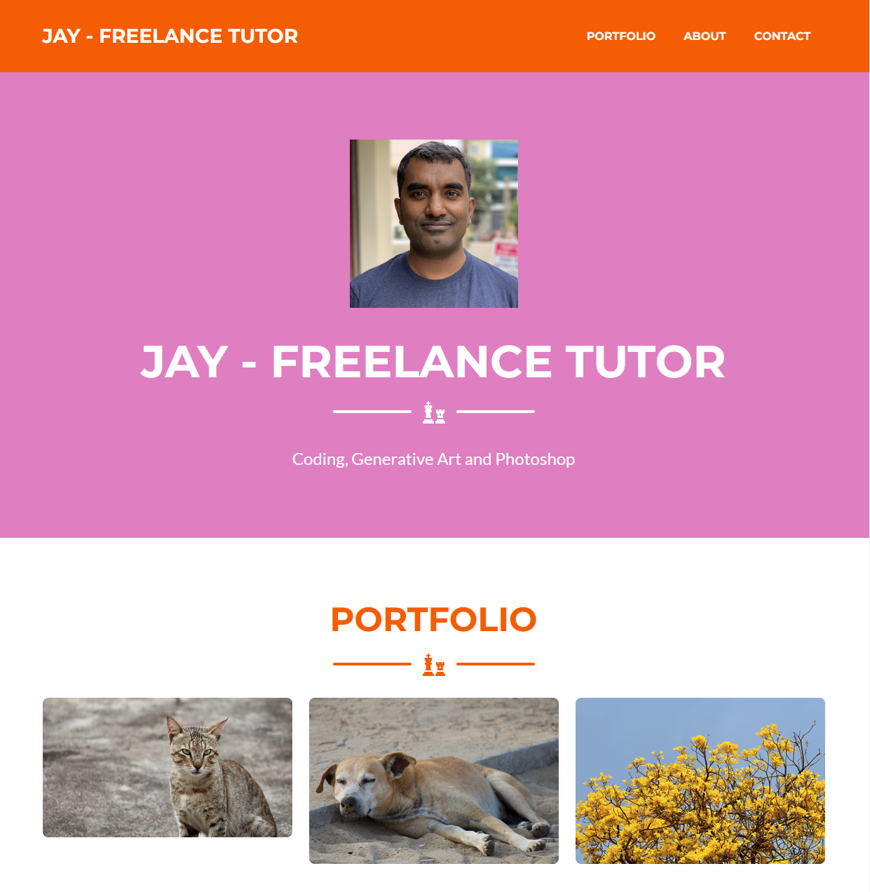

# Start Bootstrap - Freelancer

As usual, I am always prowling around on github, finding more open source projects that I can use to teach my students.

This is one of them.

# General Notes

1. clone the entire repo, from the startbootstrap source, when starting over. remember to do 'npm install' before you do anything with the code.
1. I usually delete - .editorconfig, .gitignore, LICENSE and README.MD files. You can keep them if you want. Most of these files I usually create on my own.
1. This template uses a technology called 'pug' to generate the HTML.
1. 'npm run' like how you do in React JS, runs the website in a browser with live reloading, just like React JS.
1. more npm options are available in package.json.

# Other Things

1. Remember that pug uses a 'indentation' based coding system. You miss an indentation, you miss the code and it wont work.

# References

1. https://github.com/StartBootstrap/startbootstrap-freelancer
1. https://github.com/pugjs/pug - this is the template generator that generates the final HTML code.
1. https://haikei.app/ - I used this to generate some nice SVG files. Useful for error pages and similar places where SVG is used.
1. https://stackoverflow.com/questions/72054421/randomly-populate-table-rows-in-pug-files - an error I ran into.
1. https://www.chartjs.org/docs/latest/ - Charts library used in this demo.
1. https://datatables.net/ - datatables library used in this demo.

# Hire Me

I work as a full time freelance software developer and coding tutor. Hire me at [UpWork](https://www.upwork.com/fl/vijayasimhabr) or [Fiverr](https://www.fiverr.com/jay_codeguy).

# Hobbies

I try to maintain a few hobbies.

1. Podcasting. You can listen to my [podcast here](https://stories.thechalakas.com/listen-to-podcast/).
1. Photography. You can see my photography on [Unsplash here](https://unsplash.com/@jay_neeruhaaku).
1. Digital Photorealism 3D Art and Arch Viz. You can see my work on this on [Adobe Behance](https://www.behance.net/vijayasimhabr).
1. Writing and Blogging. You can read my blogs. I have many medium Publications. [Read them here](https://medium.com/@vijayasimhabr).

# important note

This code is provided as is without any warranties. It's primarily meant for my own personal use, and to make it easy for me share code with my students. Feel free to use this code as it pleases you.

I can be reached through my website - [Jay's Developer Profile](https://jay-study-nildana.github.io/developerprofile)
