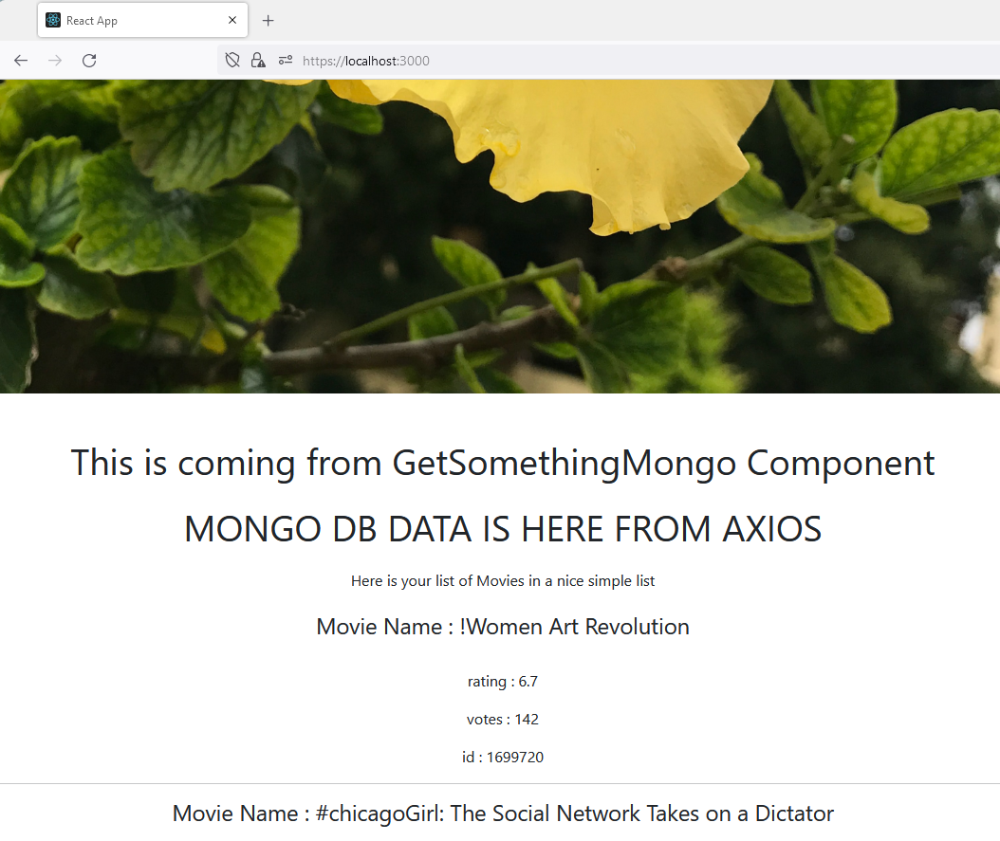

# React JS Hello World Project with https and Axios



Note : If you are just starting with React JS, I would recommend, trying this link. [create-react-app, Hello World, 2022 edition](https://medium.com/projectwt/create-react-app-hello-world-2022-edition-f36275a0e7c4)

Note : Firefox might complain that there is a security risk. Dont get scared by this. you self created this certificate. So, obviously, browsers like Firefox will complain. Click on Advanced and accept the risk and continue.

# Cross-Origin Request Blocked

You will hundred percent get this error as I am asking you to run both the React JS project and the Mongo DB API Server on the same computer : localhost. 

So, make your sure your API server has cors configured.

# Components that work with NASA API

1. GetSomething : This is a simple axios GET call. 
1. GetSomethingWithButton : just like GetSomething, but, with a buttom making the axios call. 

# Components that work with MongoDBAPICRUDHelloWorld project.

Note : you need to run this project simultaneously with the React JS project. Also, good idea to keep the postman collection open as well. You can get the [NODE API SERVER HERE](https://github.com/Jay-study-nildana/NodeJSForStudents/tree/main/MongoDB_API_CRUD_HelloWorld)

1. GetSomethingMongo : same as GetSomething but with the mongo API. get a list of movies, using GET, from mongo NODE JS API server. 
1. PostSomethingMongo : enter a movie word, and get all the movies using POST, from mongo NODE JS API server. 

# Local host running 

1. Local:            https://localhost:3000
1. On Your Network:  https://192.168.29.208:3000

Note : When doing react JS, I would strongly recommending using two computers. One computer for coding. One computer for debugging over a network. Or, you can have two monitors.

# Setting Up Project and Running

```
    npm install
    npm install axios
    npm install cors
    npm start

```

1. npm install. Installs all neccessary node modules. 
1. npm install axios add axios to the project
1. npm install cors helps you manager cors. like bypass cors errors. 
1. npm start

# Notes - General

1. I have put comments and console logs (caveman debugging) all over the place. ensure you have console open when you are running the app. 

# References

1. https://medium.com/projectwt/create-react-app-hello-world-2022-edition-f36275a0e7c4
1. https://www.freecodecamp.org/news/how-to-set-up-https-locally-with-create-react-app/
1. https://www.freecodecamp.org/news/how-to-use-axios-with-react/
1. https://www.w3schools.com/react/react_lists.asp

# Hire Me

I work as a full time freelance coding tutor. Hire me at [UpWork](https://www.upwork.com/fl/vijayasimhabr) or [Fiverr](https://www.fiverr.com/jay_codeguy). 

# Hobbies

I try to maintain a few hobbies.

1. Podcasting. You can listen to my [podcast here](https://stories.thechalakas.com/listen-to-podcast/).
1. Photography. You can see my photography on [Unsplash here](https://unsplash.com/@jay_neeruhaaku).
1. Digital Photorealism 3D Art and Arch Viz. You can see my work on this on [Adobe Behance](https://www.behance.net/vijayasimhabr).
1. Writing and Blogging. You can read my blogs. I have many medium Publications. [Read them here](https://medium.com/@vijayasimhabr).

# important note 

This code is provided as is without any warranties. It's primarily meant for my own personal use, and to make it easy for me share code with my students. Feel free to use this code as it pleases you.

I can be reached through my website - [Jay's Developer Profile](https://jay-study-nildana.github.io/developerprofile)