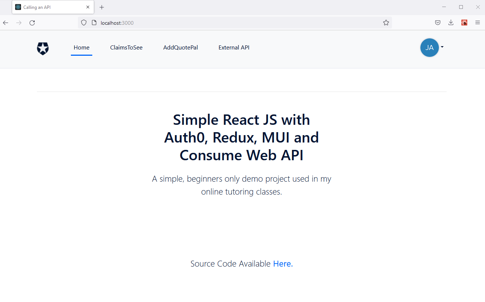

# Random Stuff Generator React App.

a practice project that consumes my random stuff project web api server - https://jay-study-nildana.github.io/RandomStuffDocs/

# Showcases the following concepts

1. Using React
1. Using Redux
1. Using Selector
1. Using Auth0 SDK
1. MUI UI components
1. Consuming Web API with and without Authentication

# Setting Up Project and Running

1. configure Auth0 details in 'auth_config.json'
1. npm install
1. npm start

# Notes

1. I have put comments and console logs (caveman debugging) all over the place. ensure you have console open when you are running the app. 
1. I am not great shakes in front end. This wont help you land an awesome front end job. However, it will help you with your internship, or perhaps, your first job. 
1. Also look at [addnewcomponents.md](addnewcomponents.md).

# References

1. https://www.linkedin.com/learning/building-modern-projects-with-react - A lot of code is built on top of the learnings I got from this guy. Excellent tutorial and excellent supplemental code. Strongly recommended for beginners.
1. https://github.com/auth0-samples/auth0-react-samples - This is what I always use a starter project. I add other things, on top of this sample. It has a simple, nice layout, and Auth0 is already built in.
1. https://mui.com/material-ui/getting-started/installation/ - This is what I use for all my UI needs. It's well maintained and easy to use.

# Hire Me

I work as a full time freelance software developer and coding tutor. Hire me at [UpWork](https://www.upwork.com/fl/vijayasimhabr) or [Fiverr](https://www.fiverr.com/jay_codeguy). 

# Hobbies

I try to maintain a few hobbies.

1. Podcasting. You can listen to my [podcast here](https://stories.thechalakas.com/listen-to-podcast/).
1. Photography. You can see my photography on [Unsplash here](https://unsplash.com/@jay_neeruhaaku).
1. Digital Photorealism 3D Art and Arch Viz. You can see my work on this on [Adobe Behance](https://www.behance.net/vijayasimhabr).
1. Writing and Blogging. You can read my blogs. I have many medium Publications. [Read them here](https://medium.com/@vijayasimhabr).

# important note 

This code is provided as is without any warranties. It's primarily meant for my own personal use, and to make it easy for me share code with my students. Feel free to use this code as it pleases you.

I can be reached through my website - [Jay's Developer Profile](https://jay-study-nildana.github.io/developerprofile)
