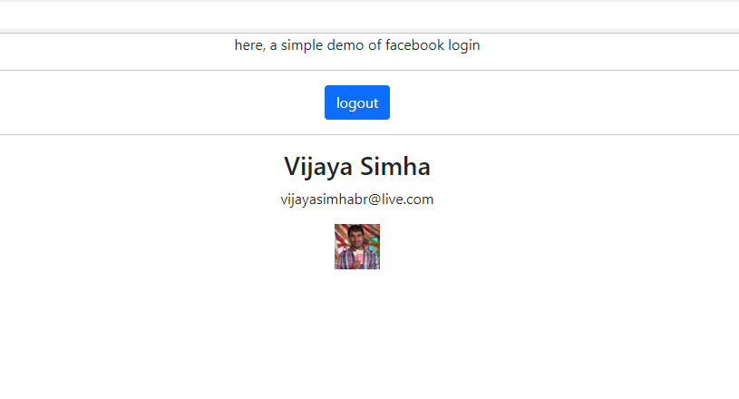

# React JS Hello World Project with fb login



Note : If you are just starting with React JS, I would recommend, trying this link. [create-react-app, Hello World, 2022 edition](https://medium.com/projectwt/create-react-app-hello-world-2022-edition-f36275a0e7c4)

Note : get your FB app id from, https://developers.facebook.com/

Note : Firefox might complain that there is a security risk. Dont get scared by this. you self created this certificate. So, obviously, browsers like Firefox will complain. Click on Advanced and accept the risk and continue.

# fbconfig.json file

Please create a file called 'fbconfig.json' in your 'src' folder. 

And, fill it up with the following values from your FB app. 

```
    {
        "appID": "appidputhere"
    }
```

# displaying fb photo 

The following code can help you show the image. 

```
    </img>
```
Note : remember to check for the value being null before you show any images and such. Otherwise, the app will crash or simply not work. 

# issue with react-facebook-login dependency

So, you will get this error. especially if you try to create a new react project. 

```
    npm ERR! ERESOLVE unable to resolve dependency tree
    npm ERR!
    npm ERR! While resolving: reactfbloginhelloworld@0.1.0
    npm ERR! Found: react@18.2.0
    npm ERR! node_modules/react
    npm ERR!   react@"^18.2.0" from the root project
    npm ERR!
    npm ERR! Could not resolve dependency:
    npm ERR! peer react@"^16.0.0" from react-facebook-login@4.1.1
    npm ERR! node_modules/react-facebook-login
    npm ERR!   react-facebook-login@"^4.1.1" from the root project
```

ultimately, to make this library work, you need to use a lower version of react library. So, after you have created the react project, update the package.json to look like this. 

```
  "dependencies": {
    "@testing-library/jest-dom": "^5.16.5",
    "@testing-library/react": "^11.0.0",
    "@testing-library/user-event": "^11.0.0",
    "react": "^16.0.0",
    "react-dom": "^16.0.0",
    "react-scripts": "5.0.1",
    "web-vitals": "^2.1.4",
    "react-facebook-login": "^4.1.1"
  },
```

# mkcert Usage

In order to get this project to run, you must ensure, that you install the local certificate. Check the reference section for more details.

The certs that you create, must match the following line from package.json.

```
  "scripts": {
    "start": "set HTTPS=true&&set SSL_CRT_FILE=./.cert/cert.pem&&set SSL_KEY_FILE=./.cert/key.pem&&react-scripts start",
    "build": "react-scripts build",
    "test": "react-scripts test",
    "eject": "react-scripts eject"
  },    
```

dont forget to ignore the cert files in your gitignore.

```
    # ignore cert folder contents
    .cert/
```

# Local host running 

Note : in this project, we are using https. setting up https requires a lot of steps. check references section for more details.

1. Local:            https://localhost:3000
1. On Your Network:  https://192.168.29.208:3000

Note : When doing react JS, I would strongly recommending using two computers. One computer for coding. One computer for debugging over a network. Or, you can have two monitors.

# Setting Up Project and Running

```
    npm install
    npm install react-facebook-login
    npm start

```

1. npm install. Installs all neccessary node modules. 
1. npm install react-facebook-login. installs the fb login library.
1. npm start

# Notes - General

1. I have put comments and console logs (caveman debugging) all over the place. ensure you have console open when you are running the app. 

# Primary References

1. https://developers.facebook.com/docs/facebook-login/overview

# References

1. https://medium.com/projectwt/react-js-localhost-with-https-using-mkcert-338927e94212
1. https://medium.com/projectwt/create-react-app-hello-world-2022-edition-f36275a0e7c4
1.https://stackoverflow.com/questions/46566830/how-to-use-create-react-app-with-an-older-react-version
1. https://www.freecodecamp.org/news/how-to-set-up-https-locally-with-create-react-app/
1. https://chocolatey.org/install
1. https://flaviocopes.com/react-how-to-configure-https-localhost/
1. https://stackoverflow.com/questions/44574399/create-react-app-how-to-use-https-instead-of-http
1. https://stackoverflow.com/questions/60374269/https-is-not-recognized-as-an-internal-or-external-command
1. https://stackoverflow.com/questions/41192491/how-can-i-provide-a-ssl-certificate-with-create-react-app/72613085#72613085
1. https://developers.facebook.com/community/threads/341403221062789/
1. https://www.tutsmake.com/react-facebook-login-example-tutorial/

# Hire Me

I work as a full time freelance coding tutor. Hire me at [UpWork](https://www.upwork.com/fl/vijayasimhabr) or [Fiverr](https://www.fiverr.com/jay_codeguy). 

# Hobbies

I try to maintain a few hobbies.

1. Podcasting. You can listen to my [podcast here](https://stories.thechalakas.com/listen-to-podcast/).
1. Photography. You can see my photography on [Unsplash here](https://unsplash.com/@jay_neeruhaaku).
1. Digital Photorealism 3D Art and Arch Viz. You can see my work on this on [Adobe Behance](https://www.behance.net/vijayasimhabr).
1. Writing and Blogging. You can read my blogs. I have many medium Publications. [Read them here](https://medium.com/@vijayasimhabr).

# important note 

This code is provided as is without any warranties. It's primarily meant for my own personal use, and to make it easy for me share code with my students. Feel free to use this code as it pleases you.

I can be reached through my website - [Jay's Developer Profile](https://jay-study-nildana.github.io/developerprofile)