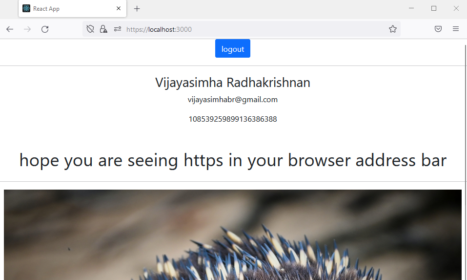

# React JS Hello World Project with google login



Note : If you are just starting with React JS, I would recommend, trying this link. [create-react-app, Hello World, 2022 edition](https://medium.com/projectwt/create-react-app-hello-world-2022-edition-f36275a0e7c4)

Note : Firefox might complain that there is a security risk. Dont get scared by this. you self created this certificate. So, obviously, browsers like Firefox will complain. Click on Advanced and accept the risk and continue.

Note : please remember that the google login library is designed to work for older versions of react. check the two files.

1. package.json
1. index.js 

to see the changes you have to make to get it to work.

# googleconfig.json file

Please create a file called 'googleconfig.json' in your 'src' folder. 

And, fill it up with the following values from your FB app. 

```
    {
        "appID": "appidputhere"
    }
```

# 'popup_closed_by_user' error

Google has recently upgraded their libraries for logging in. you will get errors. 

as mentioned before, this library is old. That is why, we need to use the 'gapi' library as a quick fix.

```
    gapi.load('client:auth2', () => {
        gapi.client.init({
            clientId: process.env.REACT_APP_GOOGLE_OAUTH_CLIENT_ID,
            plugin_name: 'chat',
        });
    });
```

# google profile image.

There is an issue with the google image. For whatever reason, it sometimes does not work. I have done the best I can, but, I dont know what I am missing. So, do keep this in mind.

# refresh = logout

the fblogin does not auto log you out. However, google might log out when you refresh. 

# Local host running 

1. Local:            https://localhost:3000
1. On Your Network:  https://192.168.29.208:3000

Note : When doing react JS, I would strongly recommending using two computers. One computer for coding. One computer for debugging over a network. Or, you can have two monitors.

# Setting Up Project and Running

```
    npm install
    npm install react-google-login
    npm install gapi-script
    npm start

```

1. npm install. Installs all neccessary node modules. 
1. npm install react-google-login. install the google login component.
1. npm install gapi-script. install the gapi script. this helps old google code, like the login library we are using, to work with the new google library. 
1. npm start

# Notes - General

1. I have put comments and console logs (caveman debugging) all over the place. ensure you have console open when you are running the app. 

# References

1. https://medium.com/projectwt/create-react-app-hello-world-2022-edition-f36275a0e7c4
1. https://www.freecodecamp.org/news/how-to-set-up-https-locally-with-create-react-app/
1. https://www.npmjs.com/package/react-google-login
1. https://github.com/anthonyjgrove/react-google-login
1. https://developers.google.com/identity/gsi/web/guides/get-google-api-clientid
1. https://www.cluemediator.com/login-with-google-using-react
1. https://github.com/anthonyjgrove/react-google-login/issues/536

# Hire Me

I work as a full time freelance coding tutor. Hire me at [UpWork](https://www.upwork.com/fl/vijayasimhabr) or [Fiverr](https://www.fiverr.com/jay_codeguy). 

# Hobbies

I try to maintain a few hobbies.

1. Podcasting. You can listen to my [podcast here](https://stories.thechalakas.com/listen-to-podcast/).
1. Photography. You can see my photography on [Unsplash here](https://unsplash.com/@jay_neeruhaaku).
1. Digital Photorealism 3D Art and Arch Viz. You can see my work on this on [Adobe Behance](https://www.behance.net/vijayasimhabr).
1. Writing and Blogging. You can read my blogs. I have many medium Publications. [Read them here](https://medium.com/@vijayasimhabr).

# important note 

This code is provided as is without any warranties. It's primarily meant for my own personal use, and to make it easy for me share code with my students. Feel free to use this code as it pleases you.

I can be reached through my website - [Jay's Developer Profile](https://jay-study-nildana.github.io/developerprofile)