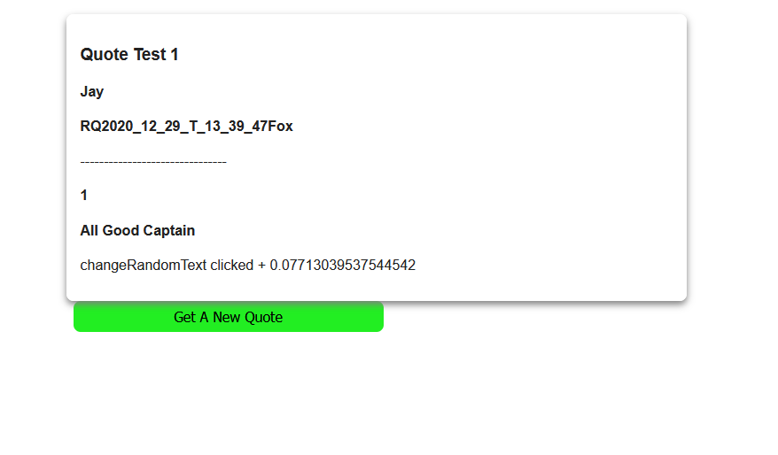

# Random Stuff Generator React App.

a practice project that consumes my random stuff project - https://jay-study-nildana.github.io/RandomStuffDocs/

# Showcases the following concepts

1. react-redux redux redux-devtools-extension redux-persist reselect styled-components redux-thunk
1. Consuming API REST services.

# Hire Me

I work as a full time freelance software developer and coding tutor. Hire me at [UpWork](https://www.upwork.com/fl/vijayasimhabr) or [Fiverr](https://www.fiverr.com/jay_codeguy).

# important note

This code is provided as is without any warranties. It's primarily meant for my own personal use, and to make it easy for me share code with my students. Feel free to use this code as it pleases you.

I can be reached through my website - [Jay's Developer Profile](https://jay-study-nildana.github.io/developerprofile)
